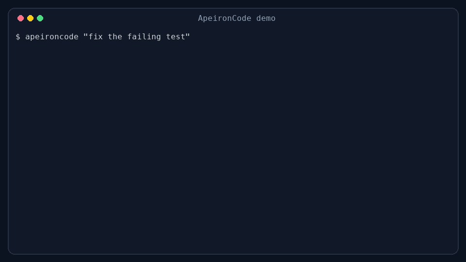

# ApeironCode

Open-source, local-first AI coding agent for developers who want control.

**Use any model. See every action. Keep your code under your rules.**



[](https://github.com/poolanithinreddy/ApeironCode/actions/workflows/ci.yml)
[](./LICENSE)
[](./package.json)

> **Early alpha, CLI-only public release.** The VS Code extension is not part of this public alpha.
> APIs and commands may change, but writes and commands remain approval-gated.

## Install

The package and one-line installer are not published yet. Install the current
alpha from source:

```bash
git clone https://github.com/poolanithinreddy/ApeironCode.git
cd ApeironCode
npm ci
npm run build
npm link
```

Verify the installation:

```bash
apeironcode --help
apeironcode setup --provider mock
apeironcode doctor
```

Mock mode is deterministic and needs no API key. For real work, configure
[Ollama or a cloud provider](./docs/providers.md).

## See It Work

The demo above is a real no-key mock-provider run against
[`examples/fix-failing-test/before`](./examples/fix-failing-test/before).
It reads the failing source, previews the exact patch, waits for approval,
reruns the test with approval, and reports the passing result. Reproduction
steps are documented in [docs/demo-recording.md](./docs/demo-recording.md).

## Why ApeironCode?

Most coding agents are closed, provider-locked, or hard to inspect.
ApeironCode is built around a different idea:

- Use local, free cloud, or premium models.
- See what files the agent reads.
- Approve risky commands before they run.
- Review every diff before accepting changes.
- Create checkpoints and roll back when needed.
- Extend workflows with agents, skills, commands, hooks, and plugins.

## Quickstart

```bash
cd your-project
apeironcode setup --local
apeironcode "explain this repository"
apeironcode "fix the failing tests"
```

Or try the offline mock provider:

```bash
apeironcode setup --provider mock
apeironcode "show project tree"
```

Simple filesystem and command requests are handled deterministically through
the same `ToolRegistry` used by model-driven work. File writes and shell
commands still require approval.

## Examples

| Use case | What it demonstrates |
| --- | --- |
| [Fix a failing test](./examples/fix-failing-test/) | Inspect, patch, approve, and rerun tests |
| [Review a pull request](./examples/review-pull-request/) | Diff-focused findings with file references |
| [GitHub Action PR review](./examples/github-action-pr-review/) | Dry-run automation with explicit permissions |

## GitHub Action

The action is intentionally dry-run by default:

```yaml
name: ApeironCode review
on:
  pull_request:

permissions:
  contents: read
  pull-requests: write

jobs:
  review:
    runs-on: ubuntu-latest
    steps:
      - uses: actions/checkout@v4
      - uses: poolanithinreddy/ApeironCode@v0.1.0
        with:
          mode: pr-review
          dry_run: true
```

See the [complete action example](./examples/github-action-pr-review/).

## Features

- Terminal-native interactive chat built with Commander.js, Ink, and React.
- One-shot execution for direct prompts from the shell.
- `apeironcode doctor` diagnostics and `apeironcode provider test` smoke checks.
- Optional Project Brain: `apeironcode brain plan` previews a user-approved `.apeironcode/` workspace memory for long app builds, with large-app orchestration, PLAN/TASKS diff-merge, a persistent sync-preview store, token-efficient context planning, and agent routing. All writes require explicit `--yes` — no silent creation. Runtime brain intelligence adds deterministic intent classification (<1ms) that selects relevant brain context per prompt, surfaced via the `brain.runtime`/`brain.explain` CLI. (A VS Code companion exists in development but is not part of this CLI alpha.)
- First-run setup with `apeironcode setup`, no-key mock-provider trial mode, `/setup`, and setup status/reset commands.
- TUI product-home flow with command echo, compact dashboard sections, `/commands beginner`, natural aliases such as `/show memory`, and temp-HOME smoke helpers via `npm run demo:tui`.
- Provider readiness UX with `apeironcode provider list`, `apeironcode provider setup`, `apeironcode provider fallback`, `apeironcode provider doctor`, `apeironcode model list`, and `apeironcode model recommend`.
- Local-first Ollama UX with `apeironcode ollama status`, `apeironcode ollama models`, `apeironcode ollama recommend`, and pull hints.
- Multi-provider architecture with Ollama, OpenAI-compatible, OpenRouter, OpenAI, Groq, DeepSeek, Gemini, and Anthropic support.
- Deterministic `mock` provider for local development, testing, and CI.
- Evented agent runtime with transcript recording, task-state tracking, approval lifecycle events, and session compaction.
- Workflow-aware agent runtime with explicit feature, debug, explain, review, refactor, commit, and test-fix flows.
- LSP-aware code intelligence with readiness detection, process-local long-lived sessions, per-file cache invalidation, live-or-fallback `symbols`, `diagnostics`, `definition`, and `references`, plus prompt-context diagnostics summaries that never block when servers are missing.
- Routed provider system with role-aware model selection, provider fallback chains, model capability catalog, and usage cost estimation.
- Safe tool execution for file reads, file metadata, file listing, glob, grep, edits, structured patches, writes, shell commands, background commands, git inspection, git commit, and build/lint/test runs.
- Live web tools: `web_fetch`, `web_search`, and `web_research` with `Network(...)` permission checks, query sanitization, and private-host blocking by default.
- Searchable history across saved sessions, task plans, edit history, project/global memory, and session-learning summaries.
- Structured session learning persisted with decisions, failed attempts, follow-up tasks, and memory load reasons.
- Experimental MCP runtime with configured endpoint discovery, server testing, tool listing, and stdio tool execution.
- Relevance-ranked project context with manifest scanning, indexed file summaries, repo-brain context packing, memory-graph facts, planning mode, and execution summaries.
- Native provider tool calling with malformed tool-input recovery prompts.
- Repo intelligence commands with `apeironcode repo`, `apeironcode repo map`, and `apeironcode repo symbols <query>`.
- Effective mode inference for plain chat prompts, with matching mode labels in the CLI preamble, execution summary, session metadata, and TUI status bar.
- Defensive display formatting so provider diagnostics, approval prompts, slash output, and error panels never degrade into `[object Object]`.
- Unified diff previews before edits and writes.
- Approval prompts for writes, commands, tests, commits, sensitive file reads, and external paths, with approval events recorded into transcripts.
- Local user config, project config, project memory, ignore rules, permissions, session persistence, session search, and transcript paths.
- Slash commands for `/help`, `/commands`, `/doctor`, `/model`, `/provider`, `/config`, `/clear`, `/compact`, `/cost`, `/history`, `/search`, `/fix`, `/debug`, `/feature`, `/review`, `/refactor`, `/commit`, `/pr`, `/test`, `/lint`, `/build`, `/tools`, `/repo`, `/context`, `/status`, `/permissions`, `/plugins`, `/sessions`, `/resume`, `/memory`, `/mcp`, `/web`, and `/exit`.
- Multi-agent sessions with process-local tracking of agent work: session lifecycle states (queued, running, paused, completed, failed, stopped), file change tracking, command/test execution logs, and file locks.
- Advisory file locks preventing concurrent modifications to files by different agent sessions within the same process. Locked for `edit_file`, `write_file`, `patch_file`, and `revert_patch`.
- Session export to Markdown, JSON, and HTML formats with automatic secret redaction. Local-only storage in `.apeironcode-agent/shares/` with file:// URLs.
- Session display and management: `apeironcode session list`, `session start`, `session show`, `session stop`, `session locks`, and `session attach` (summary view, live attach not yet supported).
- Plugin and MCP foundation with manifest loading from `.apeironcode-agent/plugins` and config-controlled enable/disable rules.
- Memory Graph 2.0 with `.apeironcode-agent/memory/graph.json`, dedupe, secret redaction, related search, review, prune, learn, "why" output, prompt retrieval, and session/task/file/skill updates after agent runs.
- Reviewable memory suggestion queue with approve/reject commands before applying proposed durable graph facts.
- Local skills system with `.apeironcode-agent/skills/<name>/skill.json` and `skill.md`, starter skills, validation, scoped CLI/TUI execution, run-plan previews, hooks, memory recording, and slash commands.
- Skill browser and templates with `apeironcode skills`, `apeironcode skill browser`, `apeironcode skill templates`, and `/skills`.
- Safe connector foundation starting with GitHub: env-only token use, repo detection, issue/PR reads, local PR review reports, approval-gated comments, and approval-gated issue/PR creation.
- Specialist agent/team registry with planner/coder/tester/reviewer/security/docs/release roles, sequential team plans, real sequential team execution, scoped tools, strict subagent policies, temp-copy and clean-repo git-worktree isolation, rename-aware three-way merge review, conflict reports, merge-resolution state, workspace-ignore hygiene, approval-gated apply, git-apply-oriented patch export/validation, local team artifacts, live TUI review cockpit surfaces, and event logs.
- Lifecycle hooks wired into sessions, planning, tools, edits, commands, commits, memory suggestions, and skill runs, with disabled-by-default shell execution and explicit approval requirement.
- Token-efficient repo brain modules for file summaries, dependency edges, context packing, prompt-context injection, and budget reporting.
- Typed code quality workflow recipes for feature implementation, test fixes, debugging, review, refactor, tests, dependency upgrades, security/performance audits, docs, and release prep, with dry-run, report storage, and runtime execution through the agent loop.
- Honest sandbox status detection with `apeironcode sandbox status`; OS-level sandboxed command execution is not implemented.
- Mock-only local eval commands with `apeironcode eval list`, `apeironcode eval run smoke`, and `apeironcode eval report`.

## Provider Matrix

| Provider | Status | Notes |
| --- | --- | --- |
| Ollama | Ready | Local-first default with `http://localhost:11434` |
| OpenAI-compatible | Ready | Works with custom base URLs and API keys |
| OpenRouter | Ready | Uses OpenRouter headers and API key env var |
| OpenAI | Ready | OpenAI-compatible implementation with OpenAI defaults |
| Groq | Ready | OpenAI-compatible implementation with Groq defaults |
| DeepSeek | Ready | OpenAI-compatible implementation with DeepSeek defaults |
| Gemini | Ready | Uses Google Generative Language API |
| Anthropic | Ready | Uses Anthropic Messages API |

ApeironCode uses a bring-your-own-key model for cloud providers. API keys are read from environment variables and are not printed in setup output. It does not support unofficial ChatGPT Plus or GitHub Copilot login reuse.

## Safety Model

- Read-only operations are low risk by default.
- File edits and writes always show a diff before approval.
- Shell commands, tests, and commits always require approval unless you explicitly pass `--dangerously-skip-approvals`.
- Web access is ask-first by default because outbound requests must match an explicit `Network(...)` allow rule or be approved interactively.
- `web_fetch` only supports `http:` and `https:` URLs and blocks `localhost` and private IP ranges unless `web.allowPrivateHosts=true` is set for trusted local testing.
- `web_search` and `web_research` redact obvious secret-like query fragments before building outbound requests.
- Sensitive files such as `.env`, SSH keys, and secret stores require explicit approval.
- Commands like `sudo`, `curl | sh`, `wget | sh`, and system path permission changes are blocked.
- High-risk commands such as `rm -rf`, destructive git resets, and `npm publish` require extra confirmation.

## Slash Commands

- `/help [command]` shows the available commands or detailed help for one command.
- `/commands [command]` is an alias for `/help` with the same examples.
- `/doctor` runs environment and provider diagnostics.
- `/model [name|list [role]|recommend [role]]` lists, recommends, or changes the default model.
- `/provider [name|list|setup [provider]|fallback [role]|doctor|test]` lists, diagnoses, configures, or changes the default provider.
- `/ollama [status|models|recommend]` checks local Ollama readiness and model recommendations.
- `/config` shows the active config summary.
- `/clear` clears the in-memory conversation.
- `/compact` summarizes and compresses the current conversation state.
- `/cost` shows token or estimated usage information.
- `/history` shows saved session, usage, and edit-history summaries.
- `/search <query>` searches saved sessions, task plans, edits, and memory.
- `/fix <request>` runs the focused bug-fix workflow.
- `/debug <request>` runs the debugging workflow.
- `/feature <request>` runs the feature implementation workflow.
- `/review [scope]` reviews the current diff by default, or a named scope such as `current diff` or `src/auth.ts`.
- `/refactor <request>` runs the refactor workflow.
- `/commit` generates a commit message and runs `git commit -m ...` with approval.
- `/pr` generates a PR description from the current diff.
- `/lint` runs the detected lint command with approval.
- `/build` runs the detected build command with approval.
- `/tools` lists the active tool registry.
- `/lsp symbols|diagnostics|definition|references|sessions|restart|stop|cache` shows live, cached, or fallback LSP state in the running TUI process.
- `/repo | /repo map | /repo symbols <query>` shows architecture, repo-map, and symbol intelligence.
- `/context [query]` prints the current project summary and relevant files for a task.
- `/status` prints current session metadata and tracked file activity.
- `/permissions list|add|remove|reset` manages permission rules without leaving the TUI.
- `/plugins [name]` lists plugin manifests and MCP endpoints, or prints one manifest in full.
- `/sessions` lists saved sessions.
- `/resume [id]` resumes a previous session.
- `/memory show|add|edit|clear|search|why` manages project memory and memory introspection.
- `/team plan|run|workspaces|runs|show|review|artifacts|artifact|merge-plan|conflicts|apply|discard` plans and runs sequential subagent teams, including temp-copy, git-worktree, artifact review, and merge-review flows.
- `/workflow list|show|run|report` lists typed recipes, previews stages, runs workflows, and shows reports.
- `/mcp list|tools <server>|test <server>` inspects configured MCP servers.
- `/web fetch <url> | /web search <query> | /web research <query>` performs live web access under the same approval model as other tools.
- `/test` runs the detected test command with approval.
- `/exit` exits the interactive app.

Workflow command help now includes inline examples such as `/fix failing tests`, `/debug paste the stack trace`, `/feature add a dark mode toggle`, and `/refactor src/auth.ts`.

## Documentation

- [Architecture](./docs/architecture.md)
- [Context Engine](./docs/context-engine.md)
- [LSP and Code Intelligence](./docs/lsp.md)
- [Multi-Agent Sessions](./docs/sessions.md)
- [Agents](./docs/agents.md)
- [Team Workflows](./docs/team.md)
- [Git Worktrees](./docs/worktrees.md)
- [Merge Review](./docs/merge-review.md)
- [Merge Resolution](./docs/merge-resolution.md)
- [Workspace Ignore Hygiene](./docs/workspace-ignore.md)
- [Rename-Aware Merge](./docs/rename-merge.md)
- [Review Cockpit](./docs/review-cockpit.md)
- [Team Artifacts](./docs/team-artifacts.md)
- [Safe Parallel Lanes](./docs/parallel-lanes.md)
- [Workflow Recipes](./docs/workflows.md)
- [Session Export & Sharing](./docs/share.md)
- [Providers](./docs/providers.md)
- [Skills](./docs/skills.md)
- [Connectors](./docs/connectors.md)
- [GitHub Connector](./docs/github.md)
- [Hooks](./docs/hooks.md)
- [Security Model](./docs/security-model.md)
- [Security Limits](./docs/security-limits.md)
- [Comparison](./docs/comparison.md)
- [Demo Script](./docs/demo-script.md)
- [Isolated Team Demo](./docs/demo-isolated-team.md)
- [Workflow Demo](./docs/demo-workflows.md)
- [Safety](./docs/safety.md)
- [Troubleshooting](./docs/troubleshooting.md)

## Mode Inference

When you stay in plain `chat` mode, ApeironCode can infer a more specific effective mode from the prompt.

- `Explain this repo` resolves to `explain`
- `Review current diff` resolves to `review`
- `Fix failing tests` resolves to `test-fix`

The effective mode is shown consistently in one-shot CLI runs, execution summaries, session metadata, and the TUI status bar. If you pass an explicit CLI mode such as `--mode chat`, that explicit mode is kept for the run.

## Code Intelligence

```bash
apeironcode lsp status
apeironcode lsp symbols src/agent/loop.ts
apeironcode lsp diagnostics src/agent/loop.ts
apeironcode lsp definition src/agent/loop.ts 10 0
apeironcode lsp references src/agent/loop.ts 10 0
apeironcode doctor
```

ApeironCode has a narrow, process-local LSP session manager rather than a full editor-style workspace integration.

ApeironCode now keeps process-local long-lived LSP sessions while the current agent or TUI process is running. Those sessions back `symbols`, `diagnostics`, `definition`, and `references`, reuse open documents, cache file-scoped results, and invalidate cached entries after file edits. They are still not IDE-grade workspace state and they do not persist across separate CLI invocations.

Stable today:

- `apeironcode lsp status` reports whether supported local language-server binaries are installed.
- `apeironcode doctor` includes LSP readiness, active session state, and cache stats in the environment report.
- `apeironcode lsp symbols <file>` and `/lsp symbols <file>` use long-lived `textDocument/documentSymbol` sessions when available, can report `source: cached LSP`, and fall back to the indexed symbol path otherwise.
- `apeironcode lsp diagnostics <file>` and `/lsp diagnostics <file>` use long-lived sessions when available and report `source: live LSP`, `source: cached LSP`, or `source: fallback analysis` explicitly.
- `apeironcode lsp definition <file> <line> <character>` and `apeironcode lsp references <file> <line> <character>` use long-lived position-based lookups when available and fall back cleanly when LSP is unavailable.
- `/lsp sessions`, `/lsp restart`, `/lsp stop`, `/lsp cache`, and `/lsp cache clear` manage the current process-local LSP runtime.
- agent prompt context and final execution summaries now include capped diagnostics for the top 1 to 2 relevant files in `debug`, `fix`, `test-fix`, `review`, and `refactor` mode.

Experimental today:

- live diagnostics still depend on whether the server actually publishes `textDocument/publishDiagnostics` for the opened or changed file during the request window.
- definition and reference lookups are still position-based.
- long-lived LSP sessions are process-local only; a fresh `apeironcode ...` CLI invocation starts with an empty session list and empty cache.
- no workspace-wide diagnostics, rename, code actions, semantic tokens, or IDE extension features are implemented.

Fallback behavior is explicit by design:

- missing servers do not break the agent or the CLI.
- fallback mode uses repository indexing, regex-based symbol hints, grep-style search, and the repo map.
- all LSP traffic is local-only between ApeironCode and the language-server process on the same machine.

Install hints:

```bash
# TypeScript / JavaScript
npm install -g typescript-language-server typescript

# Python
npm install -g pyright

# Go
go install golang.org/x/tools/gopls@latest

# Rust
rustup component add rust-analyzer
```

## Web Research

```bash
apeironcode web fetch https://example.com/spec
apeironcode web search "parser design patterns"
apeironcode web research "streaming JSON-RPC client retries"
```

- Web access is enabled in the tool registry, but outbound requests are still ask-first unless a matching `Network(...)` allow rule exists.
- `web_search` and `web_research` currently support `duckduckgo` only.
- `web_fetch` supports direct URL fetches, but blocks `file://`, `localhost`, and private IPs by default.
- For trusted local tests only, set `web.allowPrivateHosts=true` in config and add a narrow `Network(...)` allow rule.

Example project config:

```json
{
	"web": {
		"enabled": true,
		"searchProvider": "duckduckgo",
		"maxFetchChars": 6000,
		"maxSearchResults": 5,
		"allowPrivateHosts": false,
		"userAgent": "ApeironCode-Agent/0.1"
	},
	"permissions": [
		"Allow(Network(https://duckduckgo.com/*))"
	]
}
```

## Diagnostics

```bash
apeironcode doctor
apeironcode doctor --provider
apeironcode provider test
apeironcode lsp status
```

The doctor command checks runtime prerequisites, config validity, provider selection, model selection, workspace permissions, interactive TTY support, provider readiness, and LSP server availability.

Provider readiness output now includes the selected model capability profile, and the system prompt adds model-aware guidance for smaller-context or prompt-tool providers.

Provider smoke and doctor output now also pass through the same safe display formatter used by slash commands and error panels, so unexpected structured values are rendered as readable JSON rather than `[object Object]`.

For LSP specifically:

- `apeironcode lsp status` is the real readiness command today
- `apeironcode lsp symbols <file>` can report `source: live LSP`, `source: cached LSP`, or `source: fallback index`
- `apeironcode lsp diagnostics <file>` can report `source: live LSP`, `source: cached LSP`, or `source: fallback analysis`
- `apeironcode lsp definition <file> <line> <character>` and `apeironcode lsp references <file> <line> <character>` can report `source: live LSP`, `source: cached LSP`, or `source: fallback unavailable`
- `apeironcode doctor` now includes `LSP sessions` and `LSP cache` checks
- `apeironcode lsp sessions` and `apeironcode lsp cache` reflect only the current process state
- missing language servers never crash these commands; they return an honest fallback reason instead

## Testing and Acceptance

```bash
npm run typecheck
npm run lint
npm run build
npm test
npm run test:e2e
npm run check:file-size
npm pack --dry-run
```

Default tests are offline and deterministic. They use scripted native streaming chunks, mocked connector responses, temp workspaces, and redacted logs/exports, so no provider or connector API keys are required.

Useful release-readiness commands:

```bash
apeironcode eval list
apeironcode eval run smoke
apeironcode connector list
apeironcode connector env linear
apeironcode session export <id> --format markdown
apeironcode debug config
```

Eval results include estimated token-efficiency metrics such as context tokens, tool schema tokens, tool result tokens, compression ratio, and success per 1k tokens. See `docs/release-checklist.md` before publishing.

## Permissions

```bash
apeironcode permissions list
apeironcode permissions add "Bash(npm test)"
apeironcode permissions add "FileEdit(src/**)"
apeironcode permissions add "Allow(Network(https://duckduckgo.com/*))"
apeironcode permissions add "Deny(Network(http://127.0.0.1:*))"
apeironcode permissions remove "Bash(npm test)"
```

Permission rules are enforced during approval decisions for matching file, command, tool, and network operations.

Rule resolution is simple:

- `Deny(...)` wins over `Allow(...)`.
- `Allow(...)` skips the approval prompt for matching operations.
- No matching rule falls back to ask-first behavior.

See `docs/permissions.md` and `docs/web-research.md` for complete examples.

## Configuration

User config path:

```text
~/.apeironcode-agent/config.json
```

Project config path:

```text
.apeironcode-agent/config.json
```

Project memory path:

```text
.apeironcode-agent/memory.md
```

Ignore file path:

```text
.apeironcodeignore
```

Plugin manifest directory:

```text
.apeironcode-agent/plugins/*.json
```

Plugin config settings:

- `plugins.directories` adds extra manifest search paths.
- `plugins.disabled` disables named manifests without deleting them.

MCP config settings:

- `mcp.servers` configures named MCP endpoints from `.apeironcode-agent/config.json`.
- Project config entries override plugin-defined MCP endpoints with the same name.

Web config settings:

- `web.enabled` enables the built-in web tools.
- `web.searchProvider` currently supports `duckduckgo` only.
- `web.allowPrivateHosts` is `false` by default and should remain off outside trusted local testing.
- `web.maxFetchChars`, `web.maxSearchResults`, and `web.userAgent` tune request behavior.

Supported environment variables:

- `OPENAI_API_KEY`
- `OPENROUTER_API_KEY`
- `GROQ_API_KEY`
- `DEEPSEEK_API_KEY`
- `GEMINI_API_KEY`
- `ANTHROPIC_API_KEY`

## Development

```bash
npm run dev
npm run build
npm run typecheck
npm run test
npm run lint
npm run format
npm run bench:agent
```

## Docs

- Coding tasks now use a structured file-plan loop: the model proposes files
  and commands as JSON, then the runtime validates paths/content, shows a
  preview, asks approval, and executes changes through the ToolRegistry.
- `docs/providers.md` covers provider readiness, setup, and model recommendation UX.
- `docs/live-provider-smoke.md` covers smoke-test semantics.
- `docs/web-research.md` covers live web tools, search-provider setup, and safety boundaries.
- `docs/permissions.md` covers `Allow(...)` and `Deny(...)` rules, including `Network(...)`.
- `docs/memory.md` covers project memory, global memory, and session learning.
- `docs/history.md` covers `history`, `search`, and stored edit/task/session data.
- `docs/mcp.md` covers the experimental MCP runtime and current limitations.

## Demo

A short CLI walkthrough will be added after the first public alpha. In the
meantime, run `npm run smoke:dogfood` to see scripted, offline coverage of the
build / modify / error-fix flows.

## Roadmap

- Next: richer history and memory dashboards inside the TUI.
- Next: additional web search providers and richer result extraction.
- Next: broader MCP transport support beyond the current experimental stdio runtime.
- Later: a polished VS Code companion (in development, not part of this CLI alpha).

## Known limitations

- Early alpha; this is a **CLI-only** public release.
- The **VS Code extension is not included** in the public alpha.
- The standalone marketing website is developed in a separate project.
- Large full-stack / multi-service app generation is **experimental** and
  produced as phased plans, not one shot.
- Browser/visual validation is **heuristic/static** (DOM + CSS over the entry
  HTML and its linked assets), not full headless-browser rendering.
- Provider/model switching UX is still improving.
- The real TTY interaction harness is still limited.
- No full autonomy is claimed — file writes and shell commands are
  approval-gated.

## Attribution

ApeironCode Agent is an independent clean-room implementation. It does not use leaked or proprietary Claude Code source code.

This project is independently maintained and is not affiliated with, endorsed by, or maintained by Anthropic or the Claude Code team.

## Contributing

Issues and pull requests are welcome. Please run `npm run typecheck`, `npm run test`, `npm run lint`, and `npm run build` before opening a PR.

## Real Agent Guarantees

ApeironCode separates reasoning from execution: **the model plans, the runtime
executes**. Concretely:

- **Tool execution contract.** Every tool call is normalized and validated
  against that tool's own required fields before execution. Undefined/missing
  arguments never reach a tool, an invalid call is never retried identically,
  and a failure for one tool never reports another tool's error message.
- **Deterministic actions.** Obvious filesystem/command requests (create file
  or folder, list files, project tree, run a command, combined "inspect + create"
  requests) run directly through the ToolRegistry with valid, deterministic
  arguments — no provider call.
- **File plan execution.** App build/modification asks the model for a strict
  JSON file plan (one corrective retry on bad JSON, then a clean failure),
  which the runtime validates, previews, gets approved, and writes.
- **Command approval.** Plan commands are previewed and require approval; a
  failing command can feed a follow-up fix plan.
- **Pending instructions.** A bare "do the following changes in the web app"
  waits for details (no tools, no provider); the next concrete instruction is
  merged and run against the existing files.
- **Feature acceptance (no fake success).** For app builds/modifications the
  runtime extracts the requested features (e.g. todo: add input, list, toggle,
  delete, localStorage, premium UI), evaluates them against the written files,
  and asks the model for a correction plan (max 2) when features are missing.
  It will not claim "ready" when acceptance failed, the build hasn't run, or a
  command failed.
- **Build/run/fix.** "run the application" resolves a deterministic command
  (`cd <dir> && npm run dev|start`, or `open index.html`); "run the application
  and fix any errors" runs `npm run build` first and, on failure, asks for a
  fix plan and rebuilds (max 2). No empty `run_command` is ever issued.
- **todo_write is restricted.** It is not exposed to the model during app
  build/run/fix; only in explicit planning/task-management contexts. A
  malformed `todo_write` never derails or fails the task.
- **Pasted-error debugging.** Paste a runtime/build error (e.g. `Cannot read
  properties of undefined (reading 'x')`) and the runtime classifies it,
  searches the workspace for the symbol, reads the matched/likely files
  itself, gets a JSON fix plan, patches after approval, and validates with
  `npm run build`. No model `read_file`/`run_command`/`command_output`;
  pasted errors are never saved to memory.
- **Quiet by default.** Normal output is the answer plus a short Files/Commands/
  Tests footer. The full execution summary is debug-only (`--verbose` or
  `APEIRONCODE_DEBUG=1`). `command_output` is not exposed unless a background
  command session is active.

### Low-credit dogfooding

All flows are exercised offline with a fake provider and temp workspaces — no
API credits needed: `npm run smoke:real-coding`, `npm run smoke:error-fix`,
`npm run smoke:dogfood`, `npm run smoke:tui-dogfood`, the Phase 18A master
smoke `npm run smoke:master-dogfood`, and the Phase 18B terminal-UX smoke
`npm run smoke:terminal-ux`. Deterministic actions use no provider;
error fixing uses one file-plan call; app repair uses at most 1–2 correction
calls. Visual/layout repair prompts also run a deterministic, offline
**browser smoke** (DOM/CSS heuristics over the actual entry HTML + its linked
CSS/JS) and report `Browser smoke: passed/failed` honestly — ApeironCode does
not claim a premium UI passed when the rendered page can overflow, links a
missing asset, or the edited CSS is not the file the entry actually loads.
Package/framework apps report the smoke as a documented limitation (needs a
build + headless browser) instead of faking a pass.
- **Memory hygiene.** Failed tool/provider/runtime errors are never saved as
  memory; only successful, useful project facts are.
- **Compact terminal UX.** Normal mode is calm and Claude Code-like: a one-line
  status header (`ApeironCode · provider/model · workspace · status`), single
  compact tool lines (`✓ Write styles.css  +42/-12  · /revert e7`), clean
  approval cards that list the actual files (no nested boxes, no misleading
  `Files affected: none`), and short summaries. Raw diffs, tool args, and the
  full execution summary are debug-only — set `APEIRONCODE_DEBUG=1` (or
  `--verbose`) to see them.

Current limitations: very large multi-service builds are produced as phased
plans rather than one shot; small local models may still omit required JSON
fields (handled with one retry then a clean error).

## License

MIT. See [LICENSE](./LICENSE).
