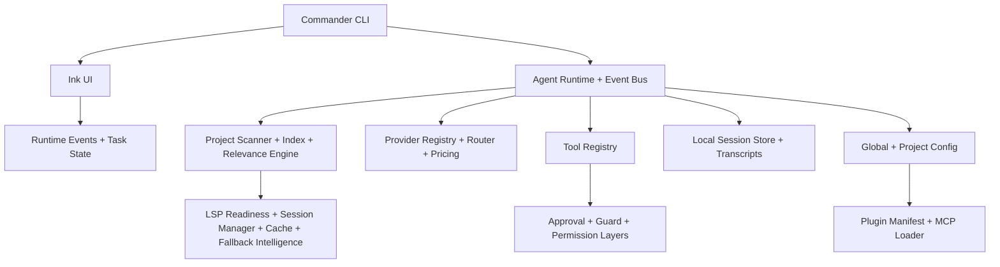

# Architecture

ApeironCode Agent is split into seven core layers.

1. `src/cli` handles Commander-based argument parsing, config subcommands, and interactive versus one-shot bootstrapping.
2. `src/ui` renders the Ink application, approval prompts, tool status cards, todo state, slash command registry, diffs, and setup flow.
3. `src/agent` owns the safe agent loop, explicit workflow selection, event emission, transcript recording, prompt protocol, planning, and session state.
4. `src/context` and `src/lsp` build the project summary from ignore-aware scanning, manifest parsing, indexed file excerpts, relevance ranking, repository-map freshness, an honest code-intelligence summary, selected live-or-fallback document-symbol summaries, and capped diagnostics summaries for the highest-value workflows.
5. `src/providers` encapsulates model transport details behind a shared `ModelProvider` interface and adds the provider catalog, role-based routing, fallback chain validation, tool-calling strategy selection, Ollama UX helpers, and model metadata.
6. `src/tools` and `src/safety` enforce the operational boundary for file system and command execution, including structured patching and command sessions.
7. `src/plugins` loads plugin manifests and MCP endpoint definitions from config-controlled directories.

The runtime loop is now evented rather than callback-only.

1. Build project context from package metadata, project tree, repository-map hints, optional project memory, LSP readiness, live-or-fallback document-symbol notes, and compact diagnostics for the top relevant files in debug/fix/test-fix/review/refactor flows.
2. Resolve the provider route for the current mode, including role overrides, fallback model selection, provider catalog metadata, and local-only constraints.
3. Resolve the effective run mode from the requested mode, session mode, and prompt intent so one-shot CLI output, status UI, and final summaries agree on the same mode label.
4. Send the system prompt, history, and user message to the active provider while recording runtime events.
5. If the provider emits one or more tool directives, validate them, execute them in sequence, update task state, and emit tool lifecycle events.
6. If the provider emits malformed tool JSON, feed a retry message back into the loop instead of silently accepting it as a final answer.
7. Feed tool results back into the conversation and continue until a final markdown answer is produced.
8. Persist the updated session, task state, transcript, and effective mode metadata locally.

Provider prompt hints use capability-aware strategy selection: native tool calling when available, compact JSON-oriented guidance for reliable JSON-mode providers, and plain-text fallback for unknown or weak profiles. Workflow modules under `src/agent/workflows` layer task-specific planning and prompt guidance on top of the shared loop so feature, debug, explain, review, refactor, commit, and test-fix flows stay explicit rather than purely prompt-driven. User-facing render paths in the CLI and Ink UI now share a defensive display formatter so unexpected structured values show up as readable JSON instead of raw object coercions.

The current LSP layer is intentionally narrow but no longer purely request-scoped. It detects whether known language-server binaries are installed, keeps process-local long-lived JSON-RPC sessions with document lifecycle tracking and per-file caching, and uses those sessions for `documentSymbol`, `definition`, `references`, and file-scoped diagnostics. Session and cache state now feed doctor output, CLI and slash command output, selected agent prompt contexts, and the TUI status line. The implementation still does not provide workspace-wide diagnostics, rename/code-action workflows, or IDE extension parity. When live LSP is unavailable or fails, ApeironCode falls back to indexed repository intelligence and reports that fallback explicitly.

This keeps provider behavior portable while making routing, transcripts, approvals, and future plugin execution first-class runtime concerns.
